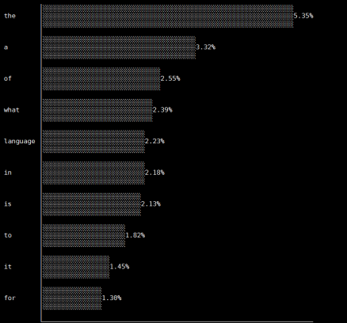

# Department of Computer Engineering

# University of Peradeniya

### CO222: Programming Methodology - Project 2

## 1 Introduction

One of the most important features of any written language is the occurrence of particular charac-
ters or words in general. For example, in the English language, all 26 characters are not used in
the same frequency. Generally, characters likee,a,tmore frequently appear in text. These kinds of
information can be used in different applications such as Machine Learning, OCR, Cryptography,
etc. The same applies for words. Prepositions and articles likethe, a, and, inare more frequently
used than other words. In project 2, you are supposed to observe this characteristic in the English
language using a program. A file or multiple files containing English text will be sent to the pro-
gram, and the program should give an output (word or character frequencies) as a horizontal bar
chart printed on the terminal.

Figure 1: The expected output from the program. The most frequently used words are displayed as
a horizontal bar chart

Fig 1 shows the expected output from the program concerning the maximum word frequencies.
There are different control and input arguments for the program. According to the arguments, the
program should be able to change its behaviour and result in the expected output.

## 2 Program output

### 2.1 Control arguments for the program

File name/ File Names

The program should be able to accept any number of file names in any order. File names will not
start with ‘-’. eg: -file.txt

Number of rows in the chart

The argument specifies the number of rows in the bar chart. It should be given as-l 10where 10 is
the limit. It can be any positive integer. A number should always follow the-largument. The pair
can be in any place of the arguments list.

Scaled option

When–scaledargument is given, the first row of the graph should fully occupy the max print width.
Any other row should scale to be matched with first row scale factor.

Word/Character toggle

The program can analyse two modes of frequencies, characters and words. If the output should be
given as words, the-wshould be given whereas-cargument will give character frequency output.

### 2.2 Default options

The program must take at least one file name to work. All other arguments are optional. If not
given, the program will work asnon-scaled, will output frequencies forwordsand limit the output
rows to 10.

### 2.3 Pre-processing

All the non-alphanumeric characters must be removed from the text. For example, the word
b@dW0rd should changed into bdW0rd. Then, it should be converted into the lower-case string,
and only the processed words should be taken into calculations.
While printing, if two words share the same frequency, the first occurred word in the text should
be printed first on the chart. Also, all the numbers should have two decimal places only.

### 2.4 Printing area

The program should work in 80 character width screen. To understand the printing pattern, please
refer to the given binary file and test with different files. It will give you a clear understanding
about how the graph is printed on the screen. The output should print exactly at the same place and
scale as the given program.
You should use std=c99 flag to compile the source code because there are several Unicode char-
acters you have to when printing the graph. They are; 2500, 2502, 2514, 2591. It is up to you
to find out what exactly these Unicode print. To print Unicode you may use printf as follows,
printf(”\u2502”);